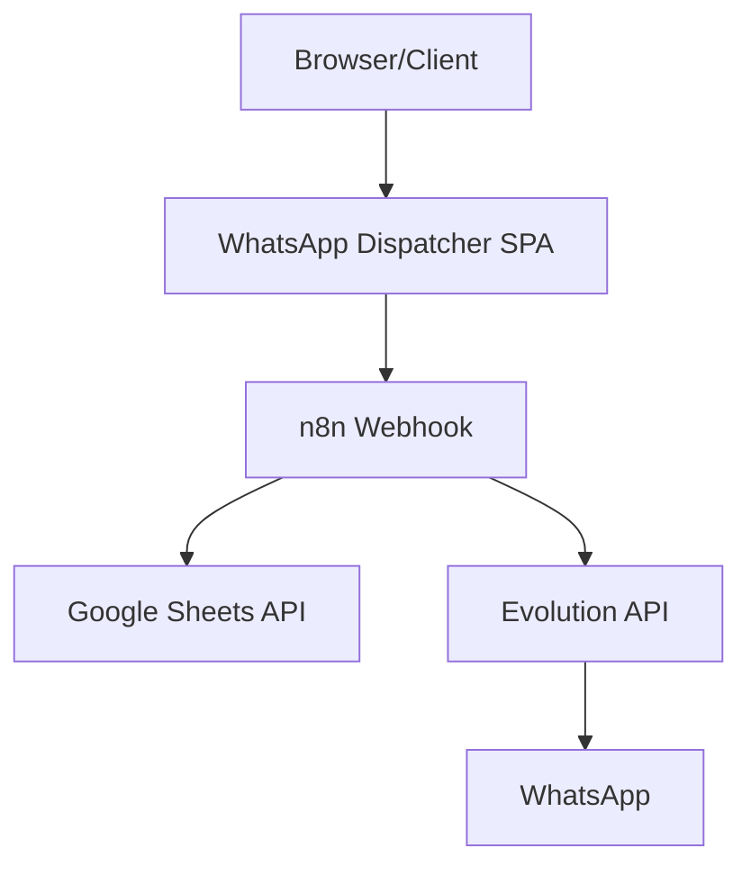

# Design Document

## Overview

O WhatsApp Dispatcher é uma Single Page Application (SPA) que fornece uma interface simples e moderna para disparar mensagens em massa via WhatsApp. A aplicação utiliza um design minimalista com tema escuro, focando na usabilidade e feedback visual imediato. O sistema integra com n8n através de webhooks para orquestrar o fluxo de envio de mensagens.

## Architecture

### High-Level Architecture



### Technology Stack

- **Frontend**: HTML5, CSS3, JavaScript (ES6+)
- **Styling**: CSS customizado com design system próprio (alternativa ao Tailwind)
- **HTTP Client**: Fetch API nativa
- **Icons**: Font Awesome ou ícones SVG inline
- **Responsividade**: CSS Grid e Flexbox

## Components and Interfaces

### 1. Main Container Component
- **Responsabilidade**: Layout principal da aplicação
- **Elementos**: Header, Main Content Area, Footer
- **Estilo**: Tema escuro com gradiente sutil

### 2. Header Component
- **Elementos**: 
  - Título principal: "Disparador de Mensagens WhatsApp"
  - Ícone do WhatsApp
- **Estilo**: Centralizado, tipografia destacada

### 3. Main Content Component
- **Elementos**:
  - Texto explicativo
  - Botão de disparo principal
  - Modal de feedback
- **Layout**: Centralizado verticalmente e horizontalmente

### 4. Dispatch Button Component
- **Características**:
  - Tamanho grande e destacado
  - Cores primárias (azul/verde)
  - Estados: normal, hover, active, loading
  - Ícone de envio/disparo
- **Comportamento**: Animações suaves de transição

### 5. Feedback Modal Component
- **Características**:
  - Overlay escuro semi-transparente
  - Modal centralizado
  - Animação de entrada/saída
  - Auto-fechamento após 3 segundos
- **Conteúdo**: Mensagem de sucesso e ícone de confirmação

### 6. Footer Component
- **Elementos**: Texto "Powered by n8n + Google Sheets + Evolution API"
- **Estilo**: Discreto, posicionado na parte inferior

## Data Models

### Configuration Object
```javascript
const config = {
  webhookUrl: 'https://your-n8n-instance.com/webhook/whatsapp-dispatcher',
  apiTimeout: 10000,
  feedbackDuration: 3000
};
```

### Request Payload
```javascript
const requestPayload = {
  action: 'dispatch_messages',
  timestamp: new Date().toISOString(),
  source: 'whatsapp-dispatcher-web'
};
```

### UI State Management
```javascript
const uiState = {
  isLoading: false,
  showModal: false,
  lastDispatchTime: null
};
```

## Error Handling

### Network Errors
- **Cenário**: Falha na conexão com o webhook
- **Tratamento**: 
  - Exibir modal com mensagem de erro
  - Log do erro no console
  - Permitir nova tentativa

### Timeout Errors
- **Cenário**: Requisição excede tempo limite
- **Tratamento**:
  - Considerar como sucesso (fire-and-forget)
  - Exibir feedback de sucesso mesmo assim
  - Log de warning no console

### Configuration Errors
- **Cenário**: URL do webhook inválida ou não configurada
- **Tratamento**:
  - Validação na inicialização
  - Exibir alerta de configuração
  - Desabilitar botão de disparo

## Testing Strategy

### Manual Testing
- **Responsividade**: Testar em diferentes tamanhos de tela
- **Interatividade**: Verificar estados do botão e modal
- **Acessibilidade**: Testar navegação por teclado

### Functional Testing
- **Disparo de Webhook**: Testar com URL válida e inválida
- **Feedback Visual**: Verificar exibição e timing do modal
- **Estados de Loading**: Confirmar comportamento durante requisição

### Browser Compatibility
- **Targets**: Chrome 90+, Firefox 88+, Safari 14+, Edge 90+
- **Features**: Fetch API, CSS Grid, ES6+ syntax

## Visual Design System

### Color Palette
```css
:root {
  /* Dark Theme */
  --bg-primary: #0f172a;
  --bg-secondary: #1e293b;
  --bg-tertiary: #334155;
  
  /* Accent Colors */
  --accent-primary: #3b82f6; /* Blue */
  --accent-secondary: #10b981; /* Green */
  --accent-success: #22c55e;
  
  /* Text Colors */
  --text-primary: #f8fafc;
  --text-secondary: #cbd5e1;
  --text-muted: #64748b;
}
```

### Typography
- **Primary Font**: 'Inter', system-ui, sans-serif
- **Headings**: Font-weight 700, letter-spacing tight
- **Body**: Font-weight 400, line-height 1.6

### Spacing System
- **Base Unit**: 4px
- **Scale**: 4px, 8px, 16px, 24px, 32px, 48px, 64px

### Component Specifications

#### Dispatch Button
- **Size**: 200px × 60px (desktop), 280px × 56px (mobile)
- **Border Radius**: 12px
- **Shadow**: 0 4px 14px rgba(59, 130, 246, 0.3)
- **Hover Effect**: Scale 1.05, shadow intensification

#### Modal
- **Size**: 400px × 200px (max-width: 90vw)
- **Border Radius**: 16px
- **Backdrop**: rgba(0, 0, 0, 0.5)
- **Animation**: Fade in + scale from 0.9 to 1.0

## Implementation Notes

### File Structure
```
whatsapp-dispatcher/
├── index.html
├── styles/
│   └── main.css
├── scripts/
│   └── app.js
└── assets/
    └── icons/
        └── whatsapp.svg
```

### Performance Considerations
- **CSS**: Minificação e otimização de seletores
- **JavaScript**: Debounce no botão para evitar múltiplos cliques
- **Assets**: Otimização de ícones SVG

### Security Considerations
- **CORS**: Configurar adequadamente no n8n
- **Input Validation**: Validar URL do webhook
- **CSP**: Content Security Policy para produção

### Accessibility Features
- **ARIA Labels**: Botões e modais com labels descritivos
- **Keyboard Navigation**: Tab order lógico
- **Screen Readers**: Anúncios de estado para feedback
- **Color Contrast**: Mínimo WCAG AA (4.5:1)